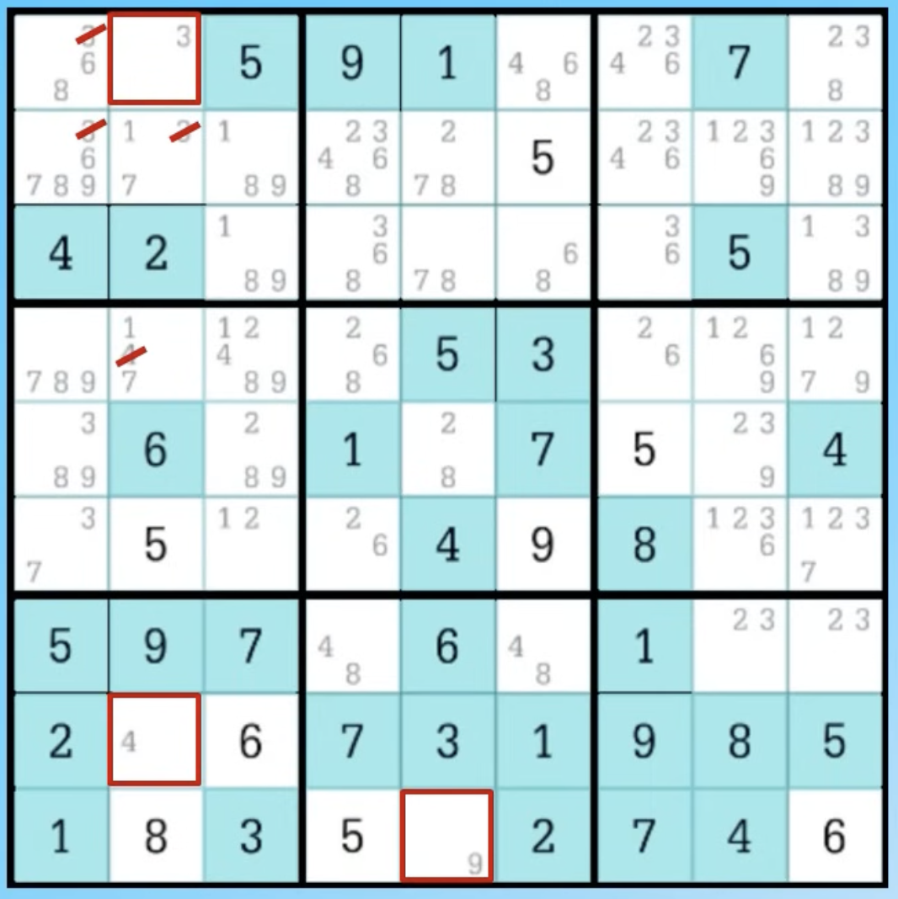
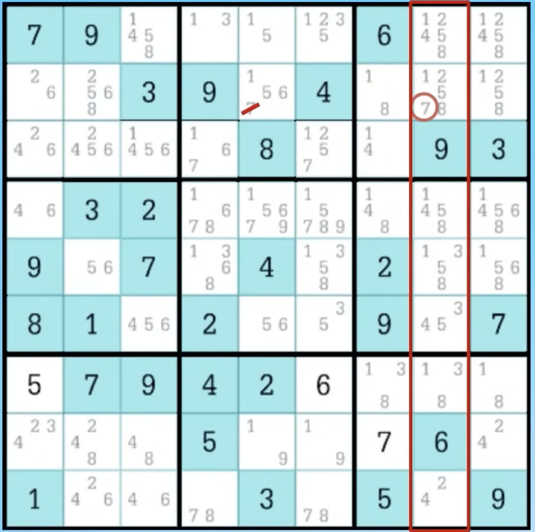
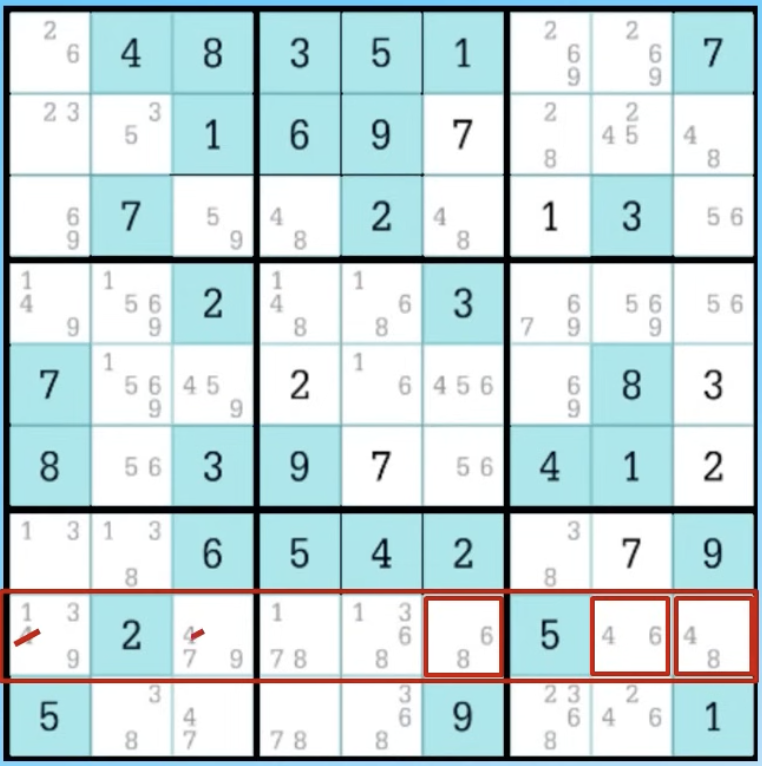
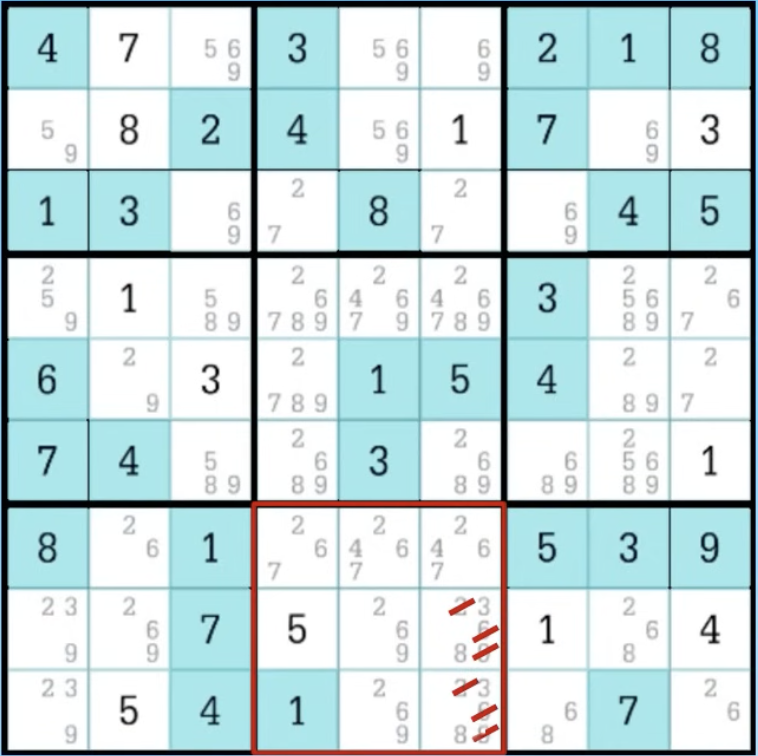
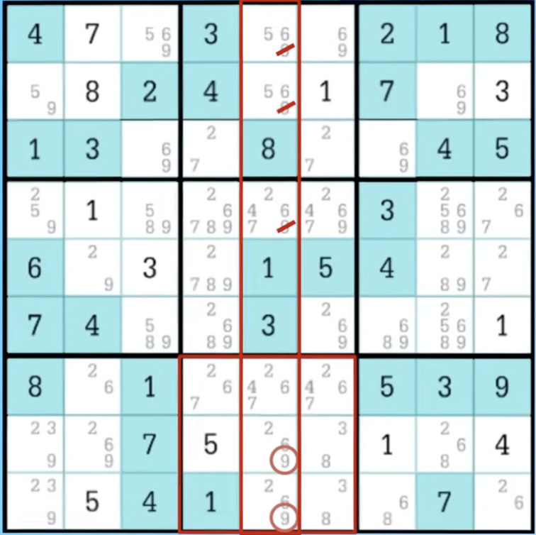
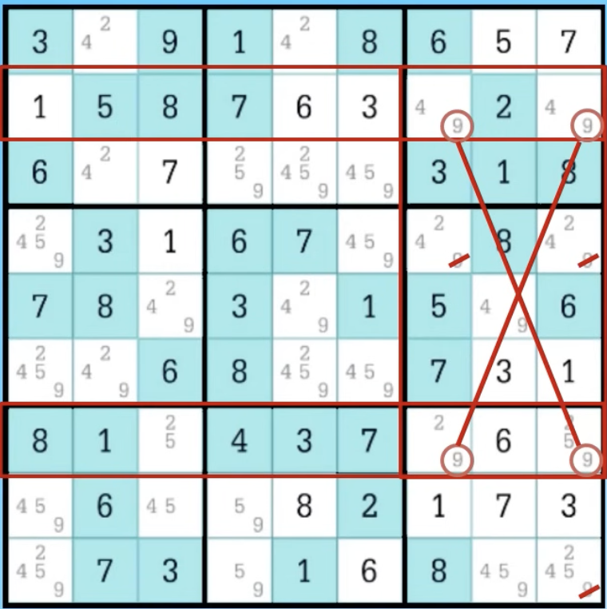

# Sudoku
This project simplifies Sudoku puzzles by categorizing them and analyzing the different strategies required to solve them.
The difficulty is split into three levels. Each technique is defined and explained below with an example.

Try: [Sudoku Solver Pro en Streamlit](http://localhost:8501)

## Easy strategies

### Naked Single
Occurs when a cell has only one possible candidate remaining because all other digits are already present in its row, column, or 3x3 block.

### Hidden Single
 Occurs when a number can only be placed in one cell within a specific row, column, or 3x3 block, even if that cell has other potential candidates.

## Medium strategies
### Naked Pairs/Triples/Quads
A set of two, three, or four cells within the same unit that contain exactly the same set of two, three, or four candidates. These candidates can be removed from all other cells in that same unit.

### Hidden Pairs/Triples/Quads
When a group of two, three, or four candidates can only be placed within a specific group of two, three, or four cells in a unit. All other candidates in those cells can be eliminated.

### Pointing Pairs/Candidates
Occurs when a candidate in a block is restricted to a single row or column. That candidate can be eliminated from the rest of that row or column outside of that specific block.

## Hard strategies

### X-Wing
A pattern where a candidate appears in only two cells in two different rows, and those cells are located in the same two columns. The candidate can be removed from all other cells in those two columns.

### Swordfish
A more complex version of the X-Wing involving three rows and three columns.

### Skyscraper
A structure where a candidate is limited to two positions in two different rows (or columns), creating a "bridge" that allows for the elimination of candidates in the intersecting lines.

### XY-Wing
A combination of three cells (a pivot and two pincers) connected by two candidates each, which allows the elimination of a common candidate in a cell that "sees" both pincers.

### Chains (Forcing Chains / XY-Chains)
A sequence of logical implications where the placement of a value in one cell forces a specific value in a chain of other cells, leading to the elimination of candidates that would otherwise cause a contradiction.

example
sudoku = [[0,8,0,6,1,0,0,0,4],
          [5,0,0,0,0,3,1,8,0],
          [0,0,0,0,0,0,9,0,0],
          [3,0,0,0,0,0,0,0,0],
          [0,0,6,0,0,0,0,2,5],
          [9,0,0,0,6,0,0,4,0],
          [0,5,1,3,0,9,7,0,0],
          [0,0,0,8,0,0,0,0,0],
          [4,0,0,0,0,0,0,0,0]]